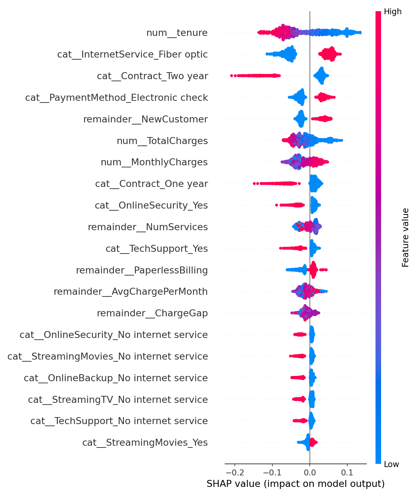

# ANÁLISIS DEL MODELO Y SU DESEMPEÑO

## 1. Descripción del modelo

El clasificador guardado consiste en un **Random Forest** de `sklearn.ensemble`, entrenado para predecir el **churn** (abandono o baja) de clientes en una empresa de telefonía a partir de variables tabulares de naturaleza económica, demográfica y contractual. La comparativa de rendimiento se realizó evaluando tres modelos predictores frente a un clasificador de referencia (baseline):

- **Random Forest** de `sklearn.ensemble.RandomForestClassifier` (Modelo Seleccionado)
- **XGBoost Classifier** de `xgboost.XGBClassifier`
- **Logistic Regression** de `sklearn.linear_model.LogisticRegression`
- **Dummy Classifier (estratificado)** de `sklearn.dummy.DummyClassifier` (Línea base o Baseline)

De los candidatos, el Random Forest fue el modelo seleccionado debido a su mejor rendimiento en términos de F1-score y ROC AUC en el conjunto de validación.

## 2. Conjunto de datos y de entrenamiento

### Conjunto original

El conjunto de datos utilizado proviene de [kaggle](https://www.kaggle.com/datasets/blastchar/telco-customer-churn/data) y se conoce como Telco Costumer Churn. En él se recogen los datos de ~7000 clientes distintos, cada uno etiquetado con una variable objetivo binaria: 1 si el cliente se dio de baja en el último mes, 0 en caso contrario, cabe recalcar el desbalance entre las dos clases de esta variable, donde la negativa corresponde al 73% de las entradas.

El conjunto presenta un alto grado de calidad en sus datos, la única anomalía era `TotalCharges`, variable que registraba valores ausentes codificados como cadenas vacías. Para un análisis más detallado del proceso de limpieza, véase el cuaderno: [EDA](../notebooks/eda.ipynb).

### Conjunto de datos procesado

En total, cada cliente cuenta con 21 variables sobre las que trabajar para realizar las predicciones (la descripción detallada de su significado se encuentra en el siguiente cuaderno: [EDA](../notebooks/eda.ipynb)). De ellas, se conservan 20 al eliminar `CustomerID`, que no aporta información útil, y se añaden 4 variables derivadas:

- **AvgChargePerMonth:** división entre el total desembolsado y el número de meses de contrato.
- **ChargeGap:** diferencia entre el importe esperado (cuota mensual × meses de contrato) y el desembolso real.
- **NewCustomer:** variable indicadora binaria (1 si lleva menos de un año en la compañía, 0 en caso contrario).
- **NumServices:** número de servicios contratados de entre los disponibles (Internet, Seguridad, Copias, Soporte, etc.).

El conjunto procesado cuenta así con un total de 24 variables.

### División de los datos

Los datos se dividen en tres conjuntos mediante `train_test_split` de `scikit-learn`: un 70% destinado a entrenamiento, y el 30% restante repartido a partes iguales entre validación y test, siempre de forma estratificada para mantener la misma proporción de churn en cada conjunto.

### Preprocesamiento y Transformación de Variables

Dependiendo de la arquitectura del modelo evaluado, se aplican diferentes transformaciones dentro del pipeline:
* **Codificación Categórica (One-Hot Encoding)**: se aplica de forma homogénea en todos los pipelines sobre las variables categóricas (`MultipleLines`, `InternetService`, `Contract`, etc.), omitiendo la primera categoría (`drop="first"`) para evitar redundancia y colinealidad.
* **Escalado Numérico (StandardScaler)**: solo se aplica en el modelo de **Regresión Logística** (`logreg`) sobre las variables numéricas continuas. Para los modelos basados en árboles (**Random Forest** y **XGBoost**), se omitió el escalado (`passthrough`) debido a que estos algoritmos son insensibles a la escala de las variables.

## 3. Hiperparámetros y configuración

El modelo final ha sido optimizado mediante búsqueda en cuadrícula (GridSearchCV). Los hiperparámetros de la búsqueda son:

### Hiperparámetros — GridSearchCV (Random Forest)

| Parámetro        | Valores probados          | Óptimo   |
|------------------|---------------------------|----------|
| `n_estimators`   | 50, 100, 200              | 100      |
| `max_depth`      | 10, 20, `None`            | 10       |
| `min_samples_split` | 2, 5, 10               | 2        |

**Mejor score CV:** 0.6405 · **Métrica:** F1-macro · **Folds:** 5

Donde:

- **`n_estimators`:** número de árboles que compone el bosque; más árboles mejoran la estabilidad de las predicciones a costa de mayor coste computacional.
- **`max_depth`:** profundidad máxima de cada árbol; limitar este valor reduce el riesgo de sobreajuste. `None` permite que el árbol crezca hasta agotar las muestras.
- **`min_samples_split`:** número mínimo de muestras necesarias para dividir un nodo; valores más altos generan árboles más simples y generalizables.

Además del Random Forest seleccionado, también se evaluaron y optimizaron mediante GridSearchCV los siguientes modelos candidatos:

### Regresión Logística (`logreg`)
Se probó con penalización ElasticNet (L1 y L2 mixto) para regularizar coeficientes:

| Parámetro  | Valores probados                   |
|------------|------------------------------------|
| `C`        | 0.01, 0.1, 1, 10, 100              |
| `l1_ratio` | 0.0, 0.25, 0.5, 0.75, 1.0          |
| `solver`   | `saga`                             |

### XGBoost Classifier (`xgboost`)
Se evaluó bajo combinaciones de profundidad de árboles y tasa de aprendizaje:

| Parámetro       | Valores probados                   |
|-----------------|------------------------------------|
| `n_estimators`  | 50, 100, 200                       |
| `learning_rate` | 0.01, 0.1, 0.2                     |
| `max_depth`     | 3, 5, 7                            |

### Threshold de decisión

Mediante la variable `THRESHOLD` definida en `src/models/train_models.py` es posible controlar el umbral de decisión de los modelos. Tras probar valores en el rango [0.3, 0.7], el que mejores resultados globales ofreció fue **0.5**, establecido como valor por defecto.

## 4. Desempeño y comparación de resultados

Durante la fase de optimización final en validación, se evaluaron todos los modelos candidatos. El modelo seleccionado fue **Random Forest**, por haber obtenido el mejor rendimiento general (especialmente en F1-Score).

A continuación se detallan las métricas de todos los modelos candidatos en el conjunto de **validación** junto con las del modelo final seleccionado en el conjunto de **test** (las métricas de test para los demás modelos se dejan vacías ya que no fueron evaluados en ese conjunto final):

| Modelo | Accuracy (Val) | ROC AUC (Val) | F1-Score (Val) | Accuracy (Test) | ROC AUC (Test) | F1-Score (Test) |
| :--- | :---: | :---: | :---: | :---: | :---: | :---: |
| **Random Forest (Óptimo)** | 0.7746 | 0.8444 | 0.6405 | 0.7862 | 0.8346 | 0.6367 |
| **XGBoost Classifier** | 0.7386 | 0.8439 | 0.6330 | — | — | — |
| **Regresión Logística** | 0.7424 | 0.8497 | 0.6284 | — | — | — |
| **Dummy Classifier (Baseline)** | 0.6080 | 0.4958 | 0.2581 | — | — | — |

Se puede apreciar cómo los tres modelos entrenados superan con creces el rendimiento del `DummyClassifier`, lo que confirma que existe una señal real y aprendible en los datos.

## 5. Explicabilidad del modelo (SHAP)

Para entender cómo toma las decisiones el modelo final seleccionado (Random Forest), se calcularon y analizaron los valores SHAP (*SHapley Additive exPlanations*) sobre el conjunto de validación.

El gráfico beeswarm resume el impacto y la dirección de las variables más influyentes en la predicción del abandono:

### Análisis de variables clave:

1. **`tenure` (Antigüedad)**: Es la variable de mayor peso global. Una baja antigüedad (azul) empuja fuertemente la predicción hacia el abandono (SHAP positivo), mientras que los clientes con alta antigüedad (rojo) tienen un riesgo de abandono muy bajo (SHAP negativo).
2. **`InternetService_Fiber optic` (Fibra óptica)**: La presencia de este tipo de conexión (rojo) incrementa de forma marcada el riesgo de churn, sugiriendo posibles áreas de fricción de precio o servicio en este segmento.
3. **`Contract_Two year` (Contrato de 2 años)**: Es el factor de retención más fuerte. Los clientes con este contrato (rojo) tienen probabilidades de churn extremadamente bajas.
4. **`PaymentMethod_Electronic check` (Pago por cheque electrónico)**: La utilización de este método de pago (rojo) se asocia directamente con un mayor riesgo de abandono.
5. **`NewCustomer` (Nuevo cliente)**: Los usuarios que llevan menos de un año en la compañía (rojo) muestran una vulnerabilidad inicial que eleva el riesgo de churn.

Muchas de estas variables ya estaban entre las más importantes en el análisis de correlación del conjunto de datos procesado,[EDA](../notebooks/eda.ipynb), lo que indica una buena alineación entre la intuición del negocio y lo que el modelo considera relevante.

### Implicaciones de negocio:

- **Antigüedad (`tenure`):** Los clientes nuevos son más propensos a abandonar. Se deberían implementar programas de retención para nuevos clientes.
- **Servicio de fibra óptica (`InternetService_Fiber optic`):** Los clientes con fibra óptica son más propensos a abandonar. Quizá por una correlación con el número de servicios, precio o tipo de contrato.
- **Contrato de 2 años (`Contract_Two year`):** Los clientes con contrato de 2 años son menos propensos a abandonar. Se deberían ofrecer incentivos para que los clientes firmen contratos de 2 años.
- **Método de pago (`PaymentMethod_Electronic check`):** Los clientes que pagan con cheque electrónico son más propensos a abandonar. Se deberían ofrecer incentivos para que los clientes cambien su método de pago.

## 6. Limitaciones del modelo:

- El modelo ha aprendido sobre datos fijos y de un lapso muy corto (1 mes). Si se tuviera un histórico de los clientes a lo largo del tiempo, se podría mejorar la precisión y utilidad del modelo.
- Los criterios que emplea el modelo para tomar decisiones pueden inducir a interpretaciones erróneas al inspeccionar el gráfico SHAP. Por ejemplo, la fibra óptica aparece correlacionada con un mayor riesgo de churn, aunque no necesariamente como causa directa — es posible que refleje el perfil del cliente asociado a este servicio: usuarios más exigentes, con contratos más flexibles y mayor disposición a cambiar de proveedor ante ofertas competidoras.
- Pese a que se han tomado medidas para mitigar el desbalanceo de clases (tales como la ponderación de pesos de clase mediante `class_weight='balanced'` en Random Forest/Logistic Regression y `scale_pos_weight` en XGBoost, tras evaluar y descartar la técnica SMOTE por empeorar la generalización del modelo), la baja proporción de abandonos en los datos limita la capacidad de obtener valores altos de recall y precision simultáneamente.